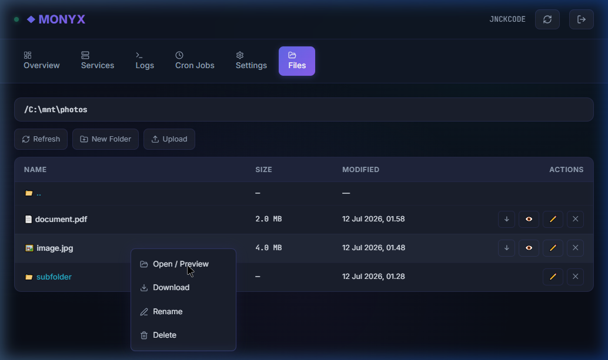
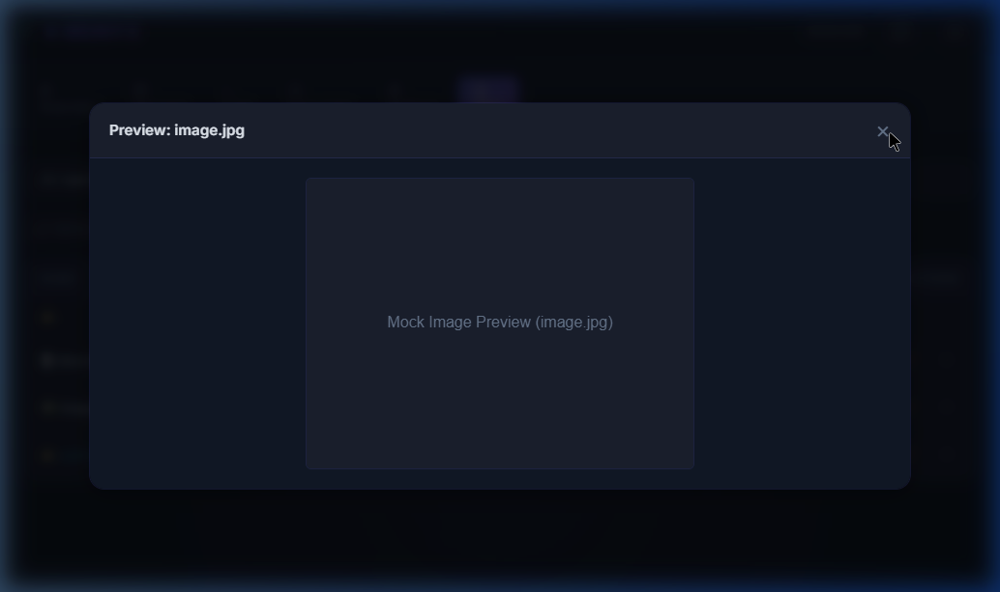

# 🌌 Monyx: Armbian Linux Server Web Monitor

[](https://nodejs.org)
[](https://www.armbian.com)
[](https://tailwindcss.com)
[](https://www.sqlite.org)

**Monyx** adalah sebuah dashboard web *single-page application* (SPA) premium, ringan, dan responsif yang dirancang khusus untuk memonitoring serta mengelola server **Armbian Linux** secara *real-time*. Memadukan desain modern bernuansa *dark mode* dan *glassmorphism* dengan backend Node.js yang cepat, aman, dan efisien.

---

## ✨ Fitur Utama

### 📊 Real-Time Monitoring & Gauges
*   **Gauge Metrik Dinamis**: Pemantauan langsung untuk penggunaan CPU, RAM, Suhu (Thermal Sensor Linux), serta kapasitas penyimpanan Disk.
*   **Grafik Historis**: Visualisasi data historis metrik sistem menggunakan Chart.js untuk memantau tren beban server.
*   **Statistik Jaringan**: Informasi real-time kecepatan transfer *Tx/Rx* (Transmit/Receive) pada antarmuka jaringan.
*   **Filter Fisik Jaringan**: Menampilkan informasi status IP adapter (`eth0`, `wlan0`, dsb) dan menyembunyikan interface virtual/tun jika diinginkan.

### ⚙️ Manajemen Layanan (Services Manager)
*   Mengontrol layanan sistem (systemd service) secara langsung seperti **Start**, **Stop**, dan **Restart**.
*   Menampilkan log sistem (systemd journal logs) secara dinamis (*real-time logs streaming*).

### ⏰ Cron Job CRUD Manager
*   Antarmuka visual untuk menambah, memperbarui, mencantumkan, dan menghapus *Cron Jobs* langsung ke berkas crontab server tanpa akses SSH.

### 📁 Advanced File Manager `/mnt/` (Modul Opsional)
*   **Pencegahan Path Traversal**: Proteksi ketat keamanan dengan isolasi folder di bawah jalur `/mnt/`.
*   **Custom Context Menu (Desktop-Style)**: Klik-kanan interaktif untuk melakukan aksi cepat seperti:
    *   *Open / Preview*
    *   *Download File*
    *   *Rename File/Folder*
    *   *Delete File/Folder*
*   **Media Preview & Streaming (HTTP Range)**: 
    *   Pemutaran langsung media Video (MP4, WebM, MKV) dan Audio (MP3, WAV) langsung di dalam browser lengkap dengan fitur pencarian durasi (*media seeking*) memanfaatkan *HTTP Range requests*.
    *   Pemuatan gambar dinamis menggunakan *Blob URL* berbasis autentikasi token.
    *   Pembaca dokumen teks / kode program terformat monospaced.
*   **Upload & Download**: Upload file multi-part hingga limit **100MB** dan download aman dengan token JWT.

---

## 📸 Antarmuka File Manager (v0.3.0)

### 1. Custom Context Menu (Klik Kanan)
Tampilan opsi melayang yang responsif terhadap posisi kursor mouse:


### 2. Media Preview Modal (Gambar/Video/Audio/Teks)
Modal interaktif premium untuk pratinjau media secara langsung:


---

## 🛠️ Teknologi & Stack

*   **Frontend**: HTML5, Vanilla JavaScript, Tailwind CSS (v3 via CDN), Lucide Icons, Chart.js.
*   **Backend**: Node.js, Express.js.
*   **Database**: SQLite 3 (menggunakan driver performa tinggi `better-sqlite3`).
*   **Autentikasi**: JSON Web Token (JWT) berbasis enkripsi payload.
*   **Upload handler**: Multer.

---

## 🚀 Panduan Memulai (Quick Start)

### 1. Persyaratan Sistem
*   Node.js (versi 16 atau lebih baru)
*   NPM (Node Package Manager)
*   OS Target: Armbian Linux (Untuk sistem non-Linux seperti Windows, backend otomatis beralih ke mode simulasi/mock data demi kemudahan pengujian).

### 2. Instalasi Lokal & Pengujian
```bash
# Clone repository ini
git clone https://github.com/jnckcode/Monyx.git
cd Monyx

# Pasang semua dependensi
npm install

# Buat file konfigurasi environment (.env)
# Isi PORT, JWT_SECRET, dan DB_PATH (misal: database.sqlite)
cp .env.example .env   # Atau buat berkas baru

# Jalankan server
node server.js
```
Akses dashboard melalui browser di alamat `http://localhost:3000`. 
*   **Kredensial Default**: `admin` / `root`.

---

## 💾 Pemasangan di Server Armbian Linux (Sebagai Systemd Service)

Proyek ini dilengkapi dengan skrip instalasi untuk memasang Monyx sebagai layanan latar belakang (*background systemd service*) agar otomatis berjalan saat server pertama kali dihidupkan (*boot*).

### Langkah Pemasangan:
```bash
# Berikan izin eksekusi skrip installer
chmod +x install.sh

# Jalankan skrip installer (memerlukan hak akses sudo)
sudo ./install.sh
```

### Langkah Penghapusan Service:
```bash
# Berikan izin eksekusi skrip uninstaller
chmod +x uninstall.sh

# Hapus instalasi service
sudo ./uninstall.sh
```

---

## 🗃️ Peta Endpoint API

Pemetaan jalur API terlindung token JWT (kecuali Auth):

| Method | Path | Keterangan |
| :--- | :--- | :--- |
| **POST** | `/api/auth/login` | Login admin, mengembalikan token JWT |
| **GET** | `/api/auth/verify` | Validasi kredensial token |
| **GET** | `/api/metrics` | Metrik utilisasi CPU, RAM, Disk, Temp |
| **GET** | `/api/services` | Daftar status layanan systemd |
| **POST** | `/api/services/:name/:action` | Mengontrol siklus layanan (start/stop/restart) |
| **GET** | `/api/logs` | Membaca log systemd journal secara real-time |
| **GET** | `/api/cron` | List Cron Jobs |
| **POST** | `/api/cron` | Menambah Cron Job baru |
| **DELETE** | `/api/cron/:id` | Menghapus Cron Job |
| **GET** | `/api/files` | Daftar isi direktori di `/mnt/` |
| **POST** | `/api/files/mkdir` | Membuat folder baru |
| **POST** | `/api/files/rename` | Mengubah nama file/folder |
| **DELETE** | `/api/files?path=xxx` | Menghapus file/folder |
| **GET** | `/api/files/download` | Download berkas |
| **GET** | `/api/files/preview` | Preview media / streaming file inline |
| **POST** | `/api/files/upload` | Unggah file (Limit 100MB) |

---

## 🔒 Lisensi
Proyek ini dilisensikan di bawah **MIT License**. Silakan gunakan, modifikasi, dan kembangkan sesuai kebutuhan Anda.
